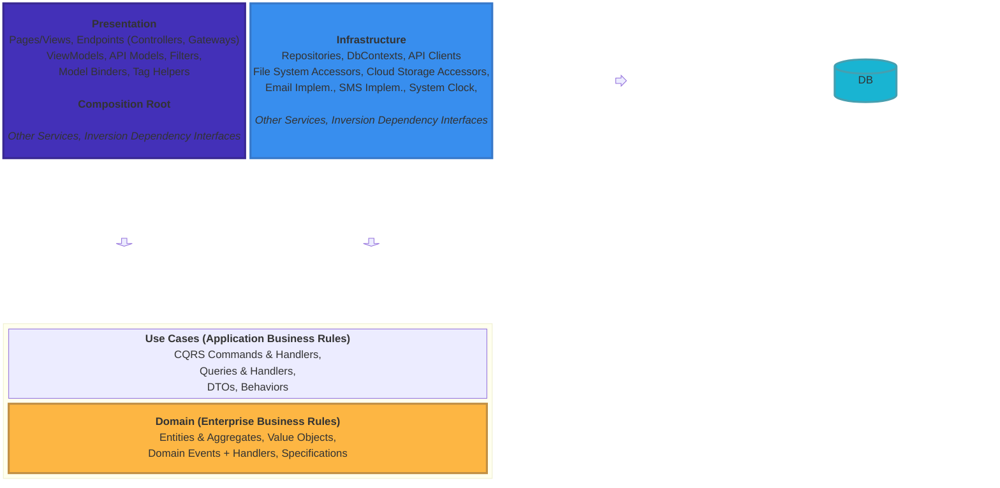

# dayspaPet

## Origins

- Initial architecture and implementation from [Blazor.Shared](https://github.com/iceHub82/Blazor.Shared) by [iceHub82](https://github.com/iceHub82).
- Manually aligned to timely design guidance by [Beth Massi](https://github.com/BethMassi) and [Eilon Lipton](https://github.com/Eilon) of Microsoft with this .NET 9 templates preview on [Github](https://github.com/BethMassi/HybridSharedUI). Be sure to view each branch, which organizes operational code for seven different combinations of interactivity location (global, per page/component) and interactivity type (InteractiveServer, InteractiveAuto, InteractiveWebAssembly).
- Manually aligned to Clean Architecture template by [ardalis](https://github.com/ardalis/CleanArchitecture) for .NET 8
  - [].NET Conf 2023: Clean Architecture with .NET 8](https://www.youtube.com/watch?v=yF9SwL0p0Y0&t=12s)
- Some helpful Dockerfile bits from [ContainerNinja.CleanArchitecture](https://github.com/referbruv/ContainerNinja.CleanArchitecture/blob/master/API/Dockerfile)
- Inspired by:
  - Nick Chapsas:  Elfocrash/clean-minimal-api
- Fluent UI thanks to [Microsoft Fluent UI Blazor Components](https://github.com/microsoft/fluentui-blazor) 
	- ... with thanks to [Fluent UI Web Components](https://github.com/microsoft/fluentui/tree/master/packages/web-components) 
		- ... with thanks to [FAST Web Components](https://github.com/microsoft/fast/tree/master/packages/web-components) which is a delight to read and experiment with.
- [Twilio: Dockerize your SQL Server and use it in ASP.NET Core with Entity Framework Core](https://www.twilio.com/en-us/blog/containerize-your-sql-server-with-docker-and-aspnet-core-with-ef-core)
- [Twilio: Dockerize your SQL Server and use it in ASP.NET Core with Entity Framework Core](https://www.twilio.com/en-us/blog/containerize-your-sql-server-with-docker-and-aspnet-core-with-ef-core)
- [On .NET Live: Next-level EF Core Data Seeding with Bogus](https://www.youtube.com/watch?v=KoEOsfrRUqk)
- [Sander Ten Brinke: Taking Entity Framework Core data seeding to the next level with Bogus](https://stenbrinke.nl/blog/taking-ef-core-data-seeding-to-the-next-level-with-bogus/)

## Architecture

- Web App: 
  - .NET 8 MAUI + WebAssembly
- Web API: 
  - .NET 8 Minimal API

### Clean Architecture

#### Diagram



#### Rules

1. Model all business rules and entities in the Core project
2. All dependencies flow inwards towards the Core project (Core project has no dependencies on any other project)
4. Inner projects define interfaces; outer projects implement them 

**Core Project Contains**
- Interfaces
- Entities, Aggregates
  - Events
  - Event Handlers
    - Good place for metrics, traces
  - Specifications
- Value Objects
- Domain Services
  - An outlier
  - Ex: Orchestration between aggregates
- Domain "Exceptions" (not necessarily implemented as a runtime exception)

## Developer Quick Start

1. Set environment variable in your VS/VSCode launch profiles, powershell/bash/zsh user profile, user scope, or system scope:
	- `NETCORE_ENVIRONMENT=Development`
	
	> Failure to do so will result in the app running in Production mode, which will not display detailed error messages.

1. Close and re-open your terminal or VS/VSCode to ensure the environment variable is set.

	> Failure to do so will result in the app running in Production mode, which will not display detailed error messages.

1. Bootstrap docker
```bash
cd ./WebApi/
docker build -t dayspapet_web_api_api .
```

## Lessons Learned the Hard Way

1. Be careful setting your MAUI project's AndroidManifest.xml ApplicationId value. Visual Studio's manifest editor won't warn you like Android Studio does about Java reserved keywords that should never be included as individual words. Doing so results in a compile-time error like:
```
1>obj\Debug\net8.0-android\android\src\com\companyname\helloworld\native\something\mymaui\R.java(8,30): javac.exe error JAVAC0000:  error: <identifier> expected
1>obj\Debug\net8.0-android\android\src\com\companyname\helloworld\native\something\mymaui\R.java(8,30): javac.exe error JAVAC0000: package com.companyname.something.native.something.mymaui;
1>obj\Debug\net8.0-android\android\src\com\companyname\helloworld\native\something\mymaui\R.java(8,30): javac.exe error JAVAC0000: 1 error
1>obj\Debug\net8.0-android\android\src\com\companyname\helloworld\native\something\mymaui\R.java(8,30): javac.exe error JAVAC0000:
```
In the example above, the word `native` is a reserved keyword in Java, so it should not be used as a standalone word in the ApplicationId value. For this reason, I recommend using a hyphenated or underscored value like `com.companyname.helloworld.native-something.mymaui` or `com.companyname.helloworld.native_something.mymaui` or just combine words as I have with `nativeclient`.

ref: https://developer.android.com/studio/build/application-id
ref: https://docs.oracle.com/javase/tutorial/java/nutsandbolts/_keywords.html
ref: https://github.com/xamarin/xamarin-android/issues/7489

2. Entity Framework requires a default parameterless constructor, or a paramaterized constructor where its parameter names and types matches those of the mapped properties.

ref: https://learn.microsoft.com/en-us/ef/core/modeling/constructors#binding-to-mapped-properties

3. Currently, Entity Framework supports Value Objects (aka Complex Types) but this support excludes data seeding (EF's `ModelBuilder.HasData`).
  - ref: https://github.com/dotnet/efcore/issues/31254

4. Nuget offers Central Package Management, a feature where you can manage all your projects' Nuget packages from a single solution-level `Directory.Package.props` file. This is useful for ensuring all projects use the same versions of packages. However, this feature currently is not straightforward when a MAUI project is in-scope of the props file:
  - 1. [dotnet/maui Issue #12953: Using central package management causes build breaking NU1009 with MAUI projects](https://github.com/dotnet/maui/issues/12953)
      - [Closed PR #17235](https://github.com/dotnet/maui/pull/17235/files)
        - [Fork PR file comparison](https://github.com/hypdeb/repros/compare/master...jonathanpeppers:MauiNuGetCPMRepro:peppers) 
