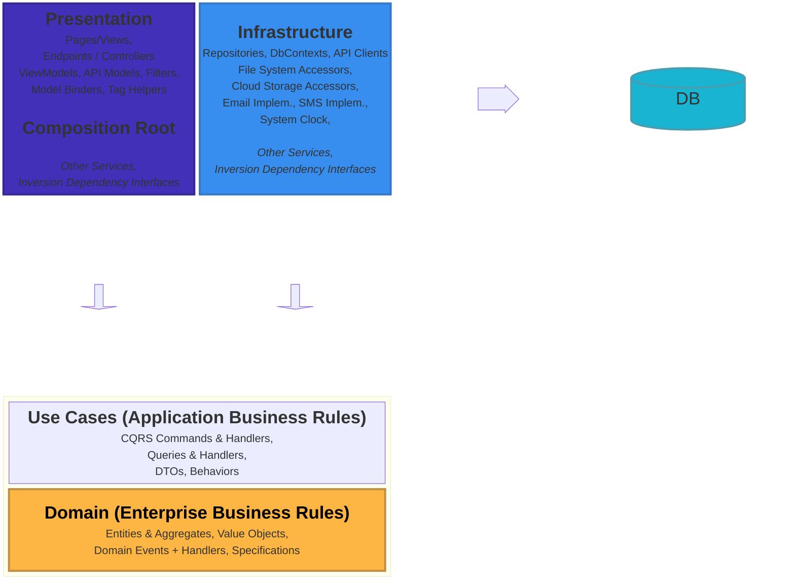

# DaySpaPet

## What

My spouse is a pet groomer and small business owner. I work and play with software engineering, and have spent the last 10 years repeatedly rewriting a full pet grooming system for this line of business and clients, targetting POS and mobile/web.  Every attempt has been wildly different than the previous, changing designs & languages or frameworks based on the latest tech I've needed to learn for work, or something I watched on an NDC talk that inspired me.

This iteration is no more likely to continue than the others, but it occurred to me that this pursuit might be useful to others while also demonstrating where my headspace is.  So I'm open-sourcing this project, and will be documenting my journey here.  Please don't put your hopes into using this for your own grooming business, it's just for my own learning and fun.  Discussion is welcomed, but I am not taking issues of any kind at this time.

## Piecemeal Origins

I've tried my very best to capture here each influence this "project" has to credit. If I've missed some, please reach out in the public discussion area.

- Initial architecture and implementation from [Blazor.Shared](https://github.com/iceHub82/Blazor.Shared) by [iceHub82](https://github.com/iceHub
- Manually aligned to timely design guidance by [Beth Massi](https://github.com/BethMassi) and [Eilon Lipton](https://github.com/Eilon) of Microsoft with this .NET 9 templates preview on [Github](https://github.com/BethMassi/HybridSharedUI). Be sure to view each branch, which organizes operational code for seven different combinations of interactivity location (global, per page/component) and interactivity type (InteractiveServer, InteractiveAuto, InteractiveWebAssembly).
- Manually aligned to Clean Architecture template by [ardalis](https://github.com/ardalis/CleanArchitecture) for .NET 8
  - .NET Conf 2023: Clean Architecture with .NET 8](https://www.youtube.com/watch?v=yF9SwL0p0Y0&t=12s)
  - Stripped out the hosted server web app, as I'm not interested in that for this project.  My use cases are all on a client
	- ... with thanks in large part to [Fluent UI Web Components](https://github.com/microsoft/fluentui/tree/master/packages/web-components) (@fluentui/web-components)
		- ... with thanks in large part to [FAST Web Components](https://github.com/microsoft/fast/tree/master/packages/web-components) (npm) which is a delight to read and experiment with.
- Some helpful Dockerfile bits from [ContainerNinja.CleanArchitecture](https://github.com/referbruv/ContainerNinja.CleanArchitecture/blob/master/API/Dockerfile)
- [Twilio: Dockerize your SQL Server and use it in ASP.NET Core with Entity Framework Core](https://www.twilio.com/en-us/blog/containerize-your-sql-server-with-docker-and-aspnet-core-with-ef-core)
- [Twilio: Dockerize your SQL Server and use it in ASP.NET Core with Entity Framework Core](https://www.twilio.com/en-us/blog/containerize-your-sql-server-with-docker-and-aspnet-core-with-ef-core)
- Sizable and realistic dev dataset generated by randomizer library Bogus (.NET-favored faker.js), deterministically and maintained alongside any model changes. 
  - Ref: [On .NET Live: Next-level EF Core Data Seeding with Bogus](https://www.youtube.com/watch?v=KoEOsfrRUqk)
  - Ref: [Sander Ten Brinke: Taking Entity Framework Core data seeding to the next level with Bogus](https://stenbrinke.nl/blog/taking-ef-core-data-seeding-to-the-next-level-with-bogus/)

## TODO: Future Stuff

- Serilog for things like structured logging, metrics, and traces
  - Ref: [Serilog](https://serilog.net/)
  - Ideally, in development environment:
    - Output all SQL to both the console and a timestamped file
- Ref: [Saga Orchestration using MassTransit in .NET](https://medium.com/@ebubekirdinc/saga-orchestration-using-masstransit-in-net-9a2fcb427c1a)
- Remove Swashbuckle, replace with NSwag
  - Ref: [Get started with NSwag and ASP.NET Core](https://learn.microsoft.com/en-us/aspnet/core/tutorials/getting-started-with-nswag?view=aspnetcore-8.0&tabs=visual-studio)
- Strongly typed IDs
  - Ref: [andrewlock/StronglyTypedId](https://github.com/andrewlock/StronglyTypedId) 
- Aggregate HTTP request information into business objects via MediatR pipelines
  - Ref: [Jimmy Bogard: Sharing Context in MediatR Pipelines](https://www.jimmybogard.com/sharing-context-in-mediatr-pipelines/)
- Loads of great advice from [Scott Sauber at NDC Sydney 2024](https://www.youtube.com/watch?v=ZqQOm0PK6ME)
  - Also [his slides from that talk](https://scottsauber.com/2024/02/13/ndc-sydney-10-things-i-do-in-every-net-app/), titled "10 Things I Do In Every .NET App"
## Physical Architecture

- Client-side platforms
  - Web Browser (evergreen)
  - Progressive Web App (PWA)
  - Native Windows, macOS, iOS, Android
- Server-side
  - REST API application, packaged into a container
  - Uses HTTP response headers and shared persistent cache for mimimizing undue impact on database
  - Uses shared database offering NoSQL-like features as well as relational
  - Asynchronous background work for report processing, image processing and persistence, notifications, and more - all fault-tolerant with capability for scaling out. 

## Physical Integration Points

1. Receipt printer
     - Epson TM-T88V, USB direct to same device as **native** client-side app, or ethernet direct on same network as client-side app.
2. Document printer
     - Any pre-configured (OS-managed) local or network-attached document printer
3. Barcode scanner
     - Any HID-compliant USB scanner
4. Webcam (for client pet photos)
     - Any pre-installed webcam
5. Cash drawer
     - APG brand, USB direct to same device as **native** client-side app

## Design Decisions

- **.NET 8 MAUI** cross-platform client-side applications, implemented with shared UI implemented in client-side Blazor.
  - **Vertical Architecture** (per page/route)
  - **Fluent UI Blazor Components**
- **.NET 8 Minimal API** for server-side REST API
  - **Clean Architecture** (Ardalis style)
- Leverage cloud platforms (with local alternatives for development) for:
  - Databases
  - Binary, NoSQL, & large text storage
  - Email notifications
  - SMS notifications

## Value-Driven Dependencies

|        Package Name         |                                                                                                  Value                                                                                                   |                                 Repository                                 |                            Source                            |                                                              License                                                              |  -  | Server-side API | Shared UI | WebAssembly Blazor (browser) | WebAssembly Blazor (PWA) | Windows | macOS | iOS | Android |
| --------------------------- | -------------------------------------------------------------------------------------------------------------------------------------------------------------------------------------------------------- | -------------------------------------------------------------------------- | ------------------------------------------------------------ | --------------------------------------------------------------------------------------------------------------------------------- | --- | --------------- | --------- | ---------------------------- | ------------------------ | ------- | ----- | --- | ------- |
| Bogus                       | Realistic, deterministic, text-based git-friendly maintainability, and LARGE dev dataset.                                                                                                                | [nuget](https://www.nuget.org/packages/Bogus)                              | [github](https://github.com/bchavez/Bogus)                   | [MIT](https://raw.githubusercontent.com/bchavez/Bogus/master/LICENSE)                                                             | -   | Yes             |           |                              |                          |         |       |     |         |
| Hangfire                    | In-process background work runtime orchestration and management, with persistent memory datastore for resilience. Provides fire-and-forget use cases as well as scheduling and outbox pattern initiator. | [nuget](https://www.nuget.org/packages/Hangfire)                           | [github](https://github.com/HangfireIO/Hangfire)             | [LGPL v3](https://raw.githubusercontent.com/HangfireIO/Hangfire/main/LICENSE.md)                                                  | -   | Yes             |           |                              |                          |         |       |     |         |
| MediatR                     | In-process CQRS and Mediator pattern framework.                                                                                                                                                          | [nuget]()                                                                  | [github]()                                                   | [LICENSE_NAME]()                                                                                                                  | -   | Yes             |           |                              |                          |         |       |     |         |
| MassTransit                 | Event-driven behavior abstraction, leveraging providers such as Redis or Redis-inspired.                                                                                                                 | [nuget](https://www.nuget.org/packages/MassTransit)                        | [github](https://github.com/MassTransit/MassTransit)         | [Apache License v2](https://raw.githubusercontent.com/MassTransit/MassTransit/develop/LICENSE)                                    | -   | Yes             |           |                              |                          |         |       |     |         |
| RabbitMQ.Client             |                                                                                                                                                                                                          | [nuget](https://www.nuget.org/packages/RabbitMQ.Client)                    | [github](https://github.com/rabbitmq/rabbitmq-dotnet-client) | [Apache License v2 + Mozilla Public License v2.0](https://raw.githubusercontent.com/rabbitmq/rabbitmq-dotnet-client/main/LICENSE) | -   | Yes             |           |                              |                          |         |       |     |         |
| MassTransit.RabbitMQ        | Messaging and streaming broker, packaged for integration with MassTransit                                                                                                                                | [nuget](https://www.nuget.org/packages/MassTransit.RabbitMQ)               | [github](https://github.com/MassTransit/MassTransit)         | [Apache License v2](https://github.com/MassTransit/MassTransit/blob/develop/LICENSE)                                              | -   | Yes             |           |                              |                          |         |       |     |         |
| Twilio                      | Email & SMS notification PaaS with support for campaigns, etc.                                                                                                                                           | [nuget]()                                                                  | [github]()                                                   | [LICENSE_NAME]()                                                                                                                  | -   | Yes             |           |                              |                          |         |       |     |         |
| Redis                       |                                                                                                                                                                                                          | [nuget]()                                                                  | [github]()                                                   | [LICENSE_NAME]()                                                                                                                  | -   | Yes             |           |                              |                          |         |       |     |         |
| FusionCache                 | In-memory and/or persistent caching with a uniform development API across usage scenarios.                                                                                                               | [nuget]()                                                                  | [github]()                                                   | [LICENSE_NAME]()                                                                                                                  | -   | Yes             |           |                              |                          |         |       |     |         |
| Serilog                     | Structured logging industry standard                                                                                                                                                                     | [nuget]()                                                                  | [github]()                                                   | [LICENSE_NAME]()                                                                                                                  | -   | Yes             |           |                              |                          |         |       |     |         |
| Fluent UI Blazor Components | Great UI component library, layout + theme provider, and more.                                                                                                                                           | [nuget](https://www.nuget.org/packages/Microsoft.Fast.Components.FluentUI) | [github](https://github.com/microsoft/fluentui-blazor)       | [Apache License v2](https://raw.githubusercontent.com/microsoft/fluentui-blazor/dev/LICENSE)                                      | -   |                 | Yes       | Yes                          | Yes                      | Yes     | Yes   | Yes | Yes     |

## Project Reference Map

| Project/Nuget Namespace | CPM Version | DaySpaPet.WebApi.Api | DaySpaPet.WebApi.Core | DaySpaPet.WebApi.Infrastructure | DaySpaPet.WebApi.SharedKernel | DaySpaPet.WebApi.UseCases | DaySpaPet.WebApp.Base | DaySpaPet.NativePlat.Client | DaySpaPet.WebApp.Wasm |
|-----------------|-------------|--------------|--------------|--------------|--------------|--------------|--------------|--------------|--------------|
| <a href="https://www.nuget.org/packages/Ardalis.GuardClauses">Ardalis.GuardClauses</a> | <a href="https://www.nuget.org/packages/Ardalis.GuardClauses/4.5.0">4.5.0</a> | - | Inherit CPM | - | Inherit CPM | - | - | - | - |
| <a href="https://www.nuget.org/packages/Ardalis.ListStartupServices">Ardalis.ListStartupServices</a> | <a href="https://www.nuget.org/packages/Ardalis.ListStartupServices/1.1.4">1.1.4</a> | Inherit CPM | - | - | - | - | Inherit CPM | - | - |
| <a href="https://www.nuget.org/packages/Ardalis.Result">Ardalis.Result</a> | <a href="https://www.nuget.org/packages/Ardalis.Result/8.0.0">8.0.0</a> | Inherit CPM | Inherit CPM | - | - | Inherit CPM | Inherit CPM | - | - |
| <a href="https://www.nuget.org/packages/Ardalis.Result.AspNetCore">Ardalis.Result.AspNetCore</a> | <a href="https://www.nuget.org/packages/Ardalis.Result.AspNetCore/8.0.0">8.0.0</a> | Inherit CPM | - | - | - | - | - | - | - |
| <a href="https://www.nuget.org/packages/Ardalis.SmartEnum">Ardalis.SmartEnum</a> | <a href="https://www.nuget.org/packages/Ardalis.SmartEnum/8.0.0">8.0.0</a> | - | Inherit CPM | - | - | - | - | - | - |
| <a href="https://www.nuget.org/packages/Ardalis.Specification">Ardalis.Specification</a> | <a href="https://www.nuget.org/packages/Ardalis.Specification/8.0.0">8.0.0</a> | - | Inherit CPM | - | Inherit CPM | - | - | - | - |
| <a href="https://www.nuget.org/packages/Ardalis.Specification.EntityFrameworkCore">Ardalis.Specification.EntityFrameworkCore</a> | <a href="https://www.nuget.org/packages/Ardalis.Specification.EntityFrameworkCore/8.0.0">8.0.0</a> | - | - | Inherit CPM | - | - | - | - | - |
| <a href="https://www.nuget.org/packages/Bogus">Bogus</a> | <a href="https://www.nuget.org/packages/Bogus/35.5.0">35.5.0</a> | - | - | Inherit CPM | - | - | - | - | - |
| <a href="https://www.nuget.org/packages/CommunityToolkit.Maui">CommunityToolkit.Maui</a> | <a href="https://www.nuget.org/packages/CommunityToolkit.Maui/N/A">N/A</a> | - | - | - | - | - | - | Inherit CPM | - |
| <a href="https://www.nuget.org/packages/FastEndpoints">FastEndpoints</a> | <a href="https://www.nuget.org/packages/FastEndpoints/5.25.0">5.25.0</a> | Inherit CPM | - | - | - | - | - | - | - |
| <a href="https://www.nuget.org/packages/FastEndpoints.ApiExplorer">FastEndpoints.ApiExplorer</a> | <a href="https://www.nuget.org/packages/FastEndpoints.ApiExplorer/2.3.0">2.3.0</a> | Inherit CPM | - | - | - | - | - | - | - |
| <a href="https://www.nuget.org/packages/FastEndpoints.Swagger">FastEndpoints.Swagger</a> | <a href="https://www.nuget.org/packages/FastEndpoints.Swagger/5.25.0">5.25.0</a> | Inherit CPM | - | - | - | - | - | - | - |
| <a href="https://www.nuget.org/packages/FastEndpoints.Swagger.Swashbuckle">FastEndpoints.Swagger.Swashbuckle</a> | <a href="https://www.nuget.org/packages/FastEndpoints.Swagger.Swashbuckle/2.3.0">2.3.0</a> | Inherit CPM | - | - | - | - | - | - | - |
| <a href="https://www.nuget.org/packages/MailKit">MailKit</a> | <a href="https://www.nuget.org/packages/MailKit/4.5.0">4.5.0</a> | - | - | Inherit CPM | - | - | - | - | - |
| <a href="https://www.nuget.org/packages/MediatR">MediatR</a> | <a href="https://www.nuget.org/packages/MediatR/12.2.0">12.2.0</a> | Inherit CPM | Inherit CPM | - | Inherit CPM | Inherit CPM | - | - | - |
| <a href="https://www.nuget.org/packages/Microsoft.AspNetCore.Components.Web">Microsoft.AspNetCore.Components.Web</a> | <a href="https://www.nuget.org/packages/Microsoft.AspNetCore.Components.Web/N/A">N/A</a> | - | - | - | - | - | Inherit CPM | - | - |
| <a href="https://www.nuget.org/packages/Microsoft.AspNetCore.Components.WebAssembly">Microsoft.AspNetCore.Components.WebAssembly</a> | <a href="https://www.nuget.org/packages/Microsoft.AspNetCore.Components.WebAssembly/N/A">N/A</a> | - | - | - | - | - | - | - | Inherit CPM |
| <a href="https://www.nuget.org/packages/Microsoft.AspNetCore.Components.WebAssembly.DevServer">Microsoft.AspNetCore.Components.WebAssembly.DevServer</a> | <a href="https://www.nuget.org/packages/Microsoft.AspNetCore.Components.WebAssembly.DevServer/N/A">N/A</a> | - | - | - | - | - | - | - | Inherit CPM |
| <a href="https://www.nuget.org/packages/Microsoft.AspNetCore.Http.Abstractions">Microsoft.AspNetCore.Http.Abstractions</a> | <a href="https://www.nuget.org/packages/Microsoft.AspNetCore.Http.Abstractions/2.2.0">2.2.0</a> | - | - | - | - | Inherit CPM | - | - | Inherit CPM |
| <a href="https://www.nuget.org/packages/Microsoft.AspNetCore.Mvc.NewtonsoftJson">Microsoft.AspNetCore.Mvc.NewtonsoftJson</a> | <a href="https://www.nuget.org/packages/Microsoft.AspNetCore.Mvc.NewtonsoftJson/8.0.4">8.0.4</a> | Inherit CPM | - | - | - | - | - | - | - |
| <a href="https://www.nuget.org/packages/Microsoft.EntityFrameworkCore.Design">Microsoft.EntityFrameworkCore.Design</a> | <a href="https://www.nuget.org/packages/Microsoft.EntityFrameworkCore.Design/N/A">N/A</a> | - | - | - | - | - | Inherit CPM | - | - |
| <a href="https://www.nuget.org/packages/Microsoft.EntityFrameworkCore.Relational">Microsoft.EntityFrameworkCore.Relational</a> | <a href="https://www.nuget.org/packages/Microsoft.EntityFrameworkCore.Relational/8.0.4">8.0.4</a> | - | - | Inherit CPM | - | Inherit CPM | - | - | - |
| <a href="https://www.nuget.org/packages/Microsoft.EntityFrameworkCore.SqlServer">Microsoft.EntityFrameworkCore.SqlServer</a> | <a href="https://www.nuget.org/packages/Microsoft.EntityFrameworkCore.SqlServer/8.0.1">8.0.1</a> | - | - | Inherit CPM | - | - | - | - | - |
| <a href="https://www.nuget.org/packages/Microsoft.EntityFrameworkCore.Tools">Microsoft.EntityFrameworkCore.Tools</a> | <a href="https://www.nuget.org/packages/Microsoft.EntityFrameworkCore.Tools/8.0.4">8.0.4</a> | Inherit CPM | - | Inherit CPM | - | - | - | - | - |
| <a href="https://www.nuget.org/packages/Microsoft.Extensions.Configuration">Microsoft.Extensions.Configuration</a> | <a href="https://www.nuget.org/packages/Microsoft.Extensions.Configuration/8.0.0">8.0.0</a> | - | - | Inherit CPM | - | - | - | - | - |
| <a href="https://www.nuget.org/packages/Microsoft.Extensions.Configuration.Binder">Microsoft.Extensions.Configuration.Binder</a> | <a href="https://www.nuget.org/packages/Microsoft.Extensions.Configuration.Binder/N/A">N/A</a> | - | - | - | - | - | - | Inherit CPM | - |
| <a href="https://www.nuget.org/packages/Microsoft.Extensions.Configuration.Json">Microsoft.Extensions.Configuration.Json</a> | <a href="https://www.nuget.org/packages/Microsoft.Extensions.Configuration.Json/N/A">N/A</a> | - | - | - | - | - | - | Inherit CPM | - |
| <a href="https://www.nuget.org/packages/Microsoft.Extensions.Logging">Microsoft.Extensions.Logging</a> | <a href="https://www.nuget.org/packages/Microsoft.Extensions.Logging/8.0.0">8.0.0</a> | - | - | Inherit CPM | - | - | - | - | - |
| <a href="https://www.nuget.org/packages/Microsoft.Extensions.Logging.Abstractions">Microsoft.Extensions.Logging.Abstractions</a> | <a href="https://www.nuget.org/packages/Microsoft.Extensions.Logging.Abstractions/8.0.1">8.0.1</a> | - | Inherit CPM | - | Inherit CPM | - | - | - | - |
| <a href="https://www.nuget.org/packages/Microsoft.Extensions.Logging.Debug">Microsoft.Extensions.Logging.Debug</a> | <a href="https://www.nuget.org/packages/Microsoft.Extensions.Logging.Debug/N/A">N/A</a> | - | - | - | - | - | - | Inherit CPM | - |
| <a href="https://www.nuget.org/packages/Microsoft.FluentUI.AspNetCore.Components">Microsoft.FluentUI.AspNetCore.Components</a> | <a href="https://www.nuget.org/packages/Microsoft.FluentUI.AspNetCore.Components/N/A">N/A</a> | - | - | - | - | - | Inherit CPM | Inherit CPM | Inherit CPM |
| <a href="https://www.nuget.org/packages/Microsoft.FluentUI.AspNetCore.Components.Emoji">Microsoft.FluentUI.AspNetCore.Components.Emoji</a> | <a href="https://www.nuget.org/packages/Microsoft.FluentUI.AspNetCore.Components.Emoji/N/A">N/A</a> | - | - | - | - | - | Inherit CPM | Inherit CPM | Inherit CPM |
| <a href="https://www.nuget.org/packages/Microsoft.FluentUI.AspNetCore.Components.Icons">Microsoft.FluentUI.AspNetCore.Components.Icons</a> | <a href="https://www.nuget.org/packages/Microsoft.FluentUI.AspNetCore.Components.Icons/N/A">N/A</a> | - | - | - | - | - | Inherit CPM | Inherit CPM | Inherit CPM |
| <a href="https://www.nuget.org/packages/Microsoft.Maui.Controls">Microsoft.Maui.Controls</a> | <a href="https://www.nuget.org/packages/Microsoft.Maui.Controls/N/A">N/A</a> | - | - | - | - | - | - | Inherit CPM | - |
| <a href="https://www.nuget.org/packages/Microsoft.Maui.Core">Microsoft.Maui.Core</a> | <a href="https://www.nuget.org/packages/Microsoft.Maui.Core/N/A">N/A</a> | - | - | - | - | - | - | Inherit CPM | - |
| <a href="https://www.nuget.org/packages/Microsoft.Maui.Essentials">Microsoft.Maui.Essentials</a> | <a href="https://www.nuget.org/packages/Microsoft.Maui.Essentials/N/A">N/A</a> | - | - | - | - | - | - | Inherit CPM | - |
| <a href="https://www.nuget.org/packages/Microsoft.Maui.Resizetizer">Microsoft.Maui.Resizetizer</a> | <a href="https://www.nuget.org/packages/Microsoft.Maui.Resizetizer/N/A">N/A</a> | - | - | - | - | - | - | Inherit CPM | - |
| <a href="https://www.nuget.org/packages/Microsoft.VisualStudio.Azure.Containers.Tools.Targets">Microsoft.VisualStudio.Azure.Containers.Tools.Targets</a> | <a href="https://www.nuget.org/packages/Microsoft.VisualStudio.Azure.Containers.Tools.Targets/1.20.1">1.20.1</a> | Inherit CPM | - | - | - | - | - | - | - |
| <a href="https://www.nuget.org/packages/Microsoft.VisualStudio.Web.CodeGeneration.Design">Microsoft.VisualStudio.Web.CodeGeneration.Design</a> | <a href="https://www.nuget.org/packages/Microsoft.VisualStudio.Web.CodeGeneration.Design/8.0.2">8.0.2</a> | Inherit CPM | - | - | - | - | Inherit CPM | - | - |
| <a href="https://www.nuget.org/packages/NodaTime">NodaTime</a> | <a href="https://www.nuget.org/packages/NodaTime/3.1.11">3.1.11</a> | - | Inherit CPM | - | Inherit CPM | - | - | - | - |
| <a href="https://www.nuget.org/packages/NodaTime.Bogus">NodaTime.Bogus</a> | <a href="https://www.nuget.org/packages/NodaTime.Bogus/3.0.2">3.0.2</a> | - | - | Inherit CPM | - | - | - | - | - |
| <a href="https://www.nuget.org/packages/Serilog.AspNetCore">Serilog.AspNetCore</a> | <a href="https://www.nuget.org/packages/Serilog.AspNetCore/8.0.1">8.0.1</a> | Inherit CPM | - | - | - | - | - | - | - |
| <a href="https://www.nuget.org/packages/Serilog.Sinks.ApplicationInsights">Serilog.Sinks.ApplicationInsights</a> | <a href="https://www.nuget.org/packages/Serilog.Sinks.ApplicationInsights/4.0.1-dev-00040">4.0.1-dev-00040</a> | Inherit CPM | - | - | - | - | - | - | - |
| <a href="https://www.nuget.org/packages/SimplerSoftware.EntityFrameworkCore.SqlServer.NodaTime">SimplerSoftware.EntityFrameworkCore.SqlServer.NodaTime</a> | <a href="https://www.nuget.org/packages/SimplerSoftware.EntityFrameworkCore.SqlServer.NodaTime/8.0.1">8.0.1</a> | - | - | Inherit CPM | - | - | - | - | - |
| <a href="https://www.nuget.org/packages/Swashbuckle.AspNetCore.Annotations">Swashbuckle.AspNetCore.Annotations</a> | <a href="https://www.nuget.org/packages/Swashbuckle.AspNetCore.Annotations/6.5.0">6.5.0</a> | Inherit CPM | - | - | - | - | - | - | - |

## Software Design

### Clean Architecture

#### Diagram



#### Rules

1. Model all business rules and entities in the Core project
2. All dependencies flow inwards towards the Core project (Core project has no dependencies on any other project)
4. Inner projects define interfaces; outer projects implement them 

**Core Project Contains**
- Interfaces
- Entities, Aggregates
  - Events
  - Event Handlers
	- Good place for metrics, traces
  - Specifications
- Value Objects
- Domain Services
  - An outlier
  - Ex: Orchestration between aggregates
- Domain "Exceptions" (not necessarily implemented as a runtime exception)

## Developer Quick Start

1. Set environment variable in your VS/VSCode launch profiles, powershell/bash/zsh user profile, user scope, or system scope:
	- `NETCORE_ENVIRONMENT=Development`
	
	> Failure to do so will result in the app running in Production mode, which will not display detailed error messages.

1. Close and re-open your terminal or VS/VSCode to ensure the environment variable is set.

	> Failure to do so will result in the app running in Production mode, which will not display detailed error messages.

1. Bootstrap docker
    ```bash
    cd ./WebApi/
    docker build -t dayspapet_web_api_api .
    ```

## Lessons Learned the Hard Way

1. Be careful setting your MAUI project's AndroidManifest.xml ApplicationId value. Visual Studio's manifest editor won't warn you like Android Studio does about Java reserved keywords that should never be included as individual words. Doing so results in a compile-time error like:
    ```
    1>obj\Debug\net8.0-android\android\src\com\companyname\helloworld\native\something\mymaui\R.java(8,30): javac.exe error JAVAC0000:  error: <identifier> expected
    1>obj\Debug\net8.0-android\android\src\com\companyname\helloworld\native\something\mymaui\R.java(8,30): javac.exe error JAVAC0000: package com.companyname.something.native.something.mymaui;
    1>obj\Debug\net8.0-android\android\src\com\companyname\helloworld\native\something\mymaui\R.java(8,30): javac.exe error JAVAC0000: 1 error
    1>obj\Debug\net8.0-android\android\src\com\companyname\helloworld\native\something\mymaui\R.java(8,30): javac.exe error JAVAC0000:
    ```
    In the example above, the word `native` is a reserved keyword in Java, so it should not be used as a standalone word in the ApplicationId value. For this reason, I recommend using a hyphenated or underscored value like `com.companyname.helloworld.native-something.mymaui` or `com.companyname.helloworld.native_something.mymaui` or just combine words as I have with `nativeclient`.

    ref: https://developer.android.com/studio/build/application-id
    ref: https://docs.oracle.com/javase/tutorial/java/nutsandbolts/_keywords.html
    ref: https://github.com/xamarin/xamarin-android/issues/7489

2. Entity Framework requires a default parameterless constructor, or a paramaterized constructor where its parameter names and types matches those of the mapped properties.

    ref: https://learn.microsoft.com/en-us/ef/core/modeling/constructors#binding-to-mapped-properties

3. Currently, Entity Framework supports Value Objects (aka Complex Types) but this support excludes data seeding (EF's `ModelBuilder.HasData`).
     - ref: https://github.com/dotnet/efcore/issues/31254

4. Nuget offers Central Package Management, a feature where you can manage all your projects' Nuget packages from a single solution-level `Directory.Package.props` file. This is useful for ensuring all projects use the same versions of packages. However, this feature currently is not straightforward when a MAUI project is in-scope of the props file:
     - [dotnet/maui Issue #12953: Using central package management causes build breaking NU1009 with MAUI projects](https://github.com/dotnet/maui/issues/12953)
	     - [Closed PR #17235](https://github.com/dotnet/maui/pull/17235/files)
		  - [Fork PR file comparison](https://github.com/hypdeb/repros/compare/master...jonathanpeppers:MauiNuGetCPMRepro:peppers) 
